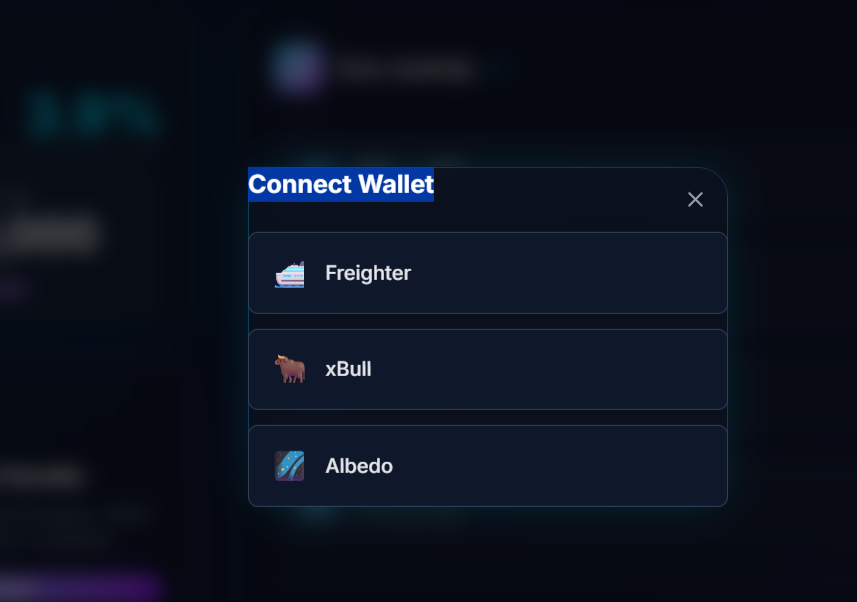
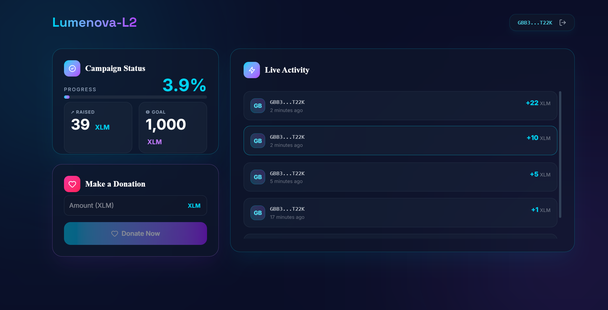
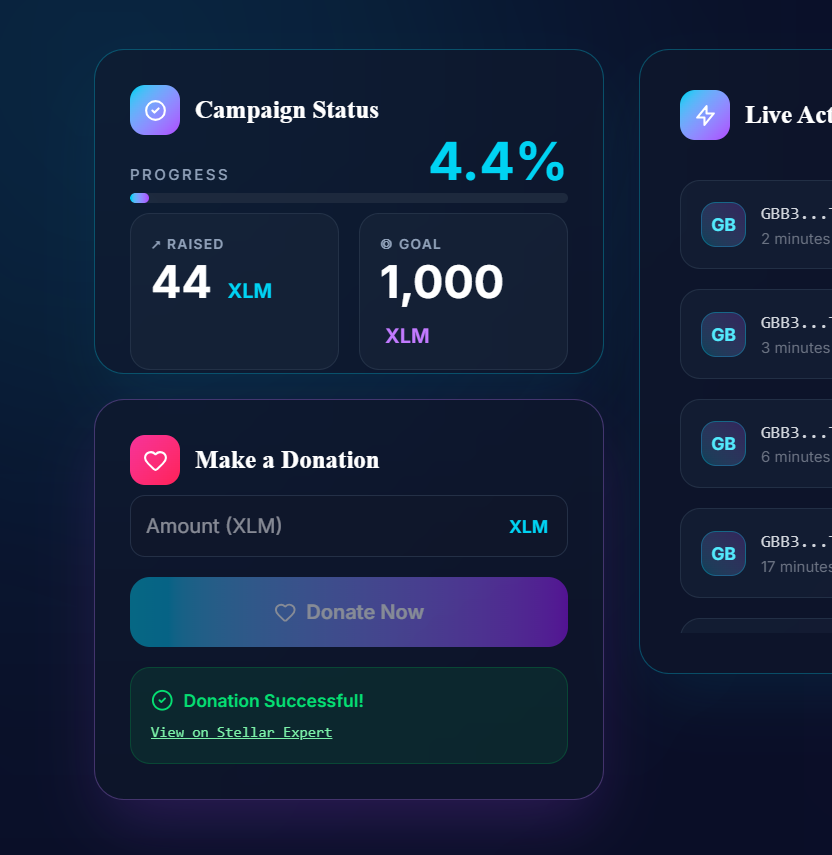
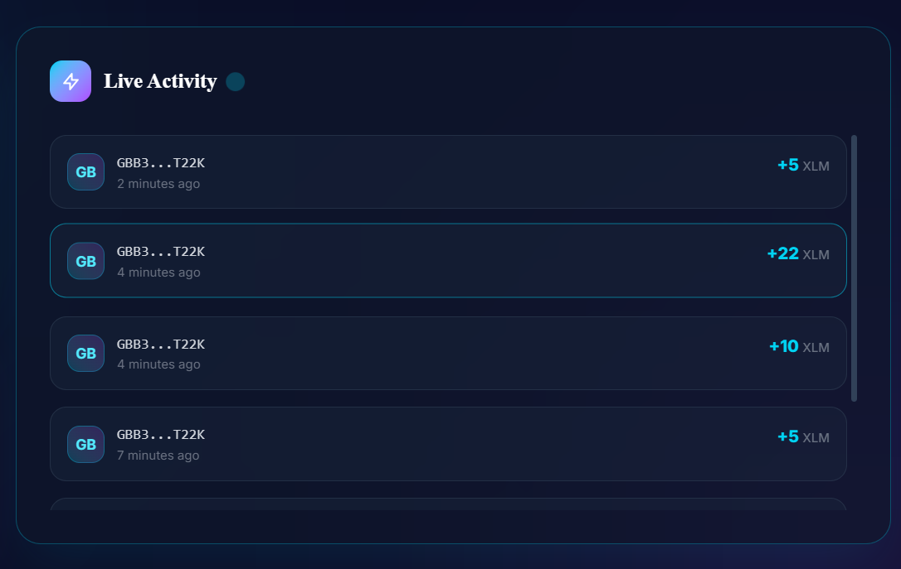

# Lumenova-L2 🟡 — Real-Time Crowdfunding dApp on Stellar Soroban

A real-time, non-custodial crowdfunding dApp deployed on the Stellar Testnet using the Soroban smart contract framework.

---

## 1. Overview
**Lumenova-L2** is a decentralized crowdfunding platform built for Level 2 (Yellow Belt) of the Stellar Builder Challenge. It allows organizers to initialize campaigns with specific funding goals and enables donors to securely contribute XLM directly to a deployed Soroban smart contract. 

The application implements real-time visual progress updates by listening to contract events emitted directly from the Stellar Testnet (eliminating the need for manual browser refreshes) and features robust transaction status tracking and wallet connections.

---

## 2. Features
- **Multi-Wallet Support:** Seamlessly connect Freighter, xBull, and Albedo wallets via `@creit.tech/stellar-wallets-kit`.
- **Soroban Smart Contract:** Complete secure storage of campaign details and logic compiled in Rust and deployed to Stellar Testnet.
- **Real-Time Progress Updates:** The UI listens to contract events to update the campaign progress bar dynamically.
- **Live Donation Feed:** A scrolling feed displaying truncated donor addresses, donation amount, and elapsed time since block confirmation.
- **Transaction Status Tracking:** Visual badges transitioning from **Pending** to **Success** (with a link to Stellar.Expert) or **Failed** (displaying the error rationale).
- **Graceful Error Handling:** Specially traps and surfaces wallet issues, user rejection prompts, and low-balance states.

---

## 3. Tech Stack
- **Frontend Framework:** React 19 (Vite)
- **Styling:** TailwindCSS v4
- **Wallet Connection:** `@creit.tech/stellar-wallets-kit`
- **Contract SDK & SDK Client:** `@stellar/stellar-sdk` & Soroban RPC Client
- **Smart Contract Language:** Rust (Soroban SDK v22)
- **Network:** Stellar Testnet (Soroban RPC: `https://soroban-testnet.stellar.org`)

---

## 4. Smart Contract Details
- **Contract Name:** `crowdfunding-contract`
- **Functions:**
  - `initialize(owner: Address, token: Address, goal: i128)`: Sets the campaign owner, native token address, and funding target (in stroops).
  - `donate(donor: Address, amount: i128)`: Transfers native XLM from the donor to the contract escrow, updates the total raised, and emits the `donate` event.
  - `withdraw()`: Transfers all accumulated native XLM tokens from the contract escrow to the campaign owner's wallet.
  - `get_total_raised() -> i128`: Returns the total amount of stroops contributed.
  - `get_goal() -> i128`: Returns the target goal amount in stroops.
- **Deployed Contract ID:** `CAKVP6WJITLBTZOCGL4JEEKYWPYDT7EXREE6EM27WJV6Y7WTWNVCCYXS`
- **Stellar.Expert Link:** [View Contract on Stellar.Expert](https://stellar.expert/explorer/testnet/contract/CAKVP6WJITLBTZOCGL4JEEKYWPYDT7EXREE6EM27WJV6Y7WTWNVCCYXS)

---

## 5. Prerequisites
- **Node.js:** v18.0.0 or higher
- **Rust & Soroban CLI:** Only required if compiling and deploying the contract independently.
- **Stellar Wallet Extension:** Freighter, xBull, or Albedo installed in your browser.
- **Testnet XLM:** Funded via Friendbot for network transaction fees.

---

## 6. Setup & Installation

1. **Clone the Repository:**
   ```bash
   git clone https://github.com/your-username/Lumenova-L2.git
   cd Lumenova-L2
   ```

2. **Install Dependencies:**
   ```bash
   npm install
   ```

3. **Configure Environment (Optional):**
   *Create a `.env` file in the root directory (the app falls back to the default testnet contract if left unset):*
   ```env
   VITE_CONTRACT_ID=CAKVP6WJITLBTZOCGL4JEEKYWPYDT7EXREE6EM27WJV6Y7WTWNVCCYXS
   VITE_RPC_URL=https://soroban-testnet.stellar.org
   ```

4. **Run the Development Server:**
   ```bash
   npm run dev
   ```
   Open `http://localhost:5173` (or the port specified by Vite) in your browser.

---

## 7. How to Use
1. **Connect Wallet:** Click "Connect Wallet" at the top right and select Freighter, xBull, or Albedo. Approve the connection request in the popup.
2. **Review Campaign Status:** View the real-time funding progress percentage and current raised amount vs the goal.
3. **Submit a Donation:** Enter an amount of XLM inside the "Make a Donation" card and click "Donate Now".
4. **Sign Transaction:** Sign the generated Soroban invocation in the wallet prompt.
5. **Verify Confirmation:** Once confirmed, copy the transaction hash or click the link to inspect it on Stellar.Expert. The live feed and progress bar will update immediately.

---

## 8. Sample Transaction
- **Initialization Transaction Hash:** `e5f9eab8322fb8010ff0d5890e8e77c5145bb20bd4f617356abfac9b79fe7e43`
- **Explorer Verification:** [Verify Initialization on Stellar.Expert](https://stellar.expert/explorer/testnet/tx/e5f9eab8322fb8010ff0d5890e8e77c5145bb20bd4f617356abfac9b79fe7e43)
- **Deployment Transaction Hash:** `eabcd0d4cd50081f03a59e6da79442789c62b6bf0d5a5a84c7e993403345824e`
- **Explorer Verification:** [Verify Deployment on Stellar.Expert](https://stellar.expert/explorer/testnet/tx/eabcd0d4cd50081f03a59e6da79442789c62b6bf0d5a5a84c7e993403345824e)

---

## 9. Screenshots
- **Wallet Connection Modal:**
  
- **Campaign Dashboard & Progress Bar:**
  
- **Successful Donation Notification:**
  
  
  **Stellar Expert Verification:** [Verify Transaction on Stellar.Expert](https://stellar.expert/explorer/testnet/tx/d23a6b505041c008267a76a89ad2bbc06c2fa8a3e9d4736c79ed14425b10e6af)
- **Live Donation Activity Feed:**
  

---

## 10. Error Handling Implemented
- **Wallet not found / not installed:** Prompts the user to install the selected extension before attempting to connect.
- **User rejected signing:** Gracefully catches cancelled prompt promises and surfaces a `"Transaction cancelled by user"` message.
- **Insufficient balance:** Validates wallet balance states before and during transaction simulation to trigger `"Insufficient XLM balance for this donation"`.

---

## 11. Commit History Note
This project includes multiple meaningful commits showing a structured step-by-step implementation. Review the git logs (`git log`) for the clean chronological progress of the smart contract logic and frontend integration.

---

## 12. Live Demo (Optional)
- **Live Deployment Link:** *Coming soon! (Will be deployed to Vercel/Netlify)*

---

## 13. Known Limitations & Next Steps
This project currently reflects the Level 2 scope. Planned upgrades for Level 3 (Green Belt):
- Custom token support (e.g., donating in custom SAC assets instead of just native XLM).
- Multi-campaign registry allowing users to deploy and manage their own individual crowdfunding campaigns.
- Refined caching layer to optimize Soroban RPC request usage.

---

## 14. License
This project is licensed under the MIT License.
